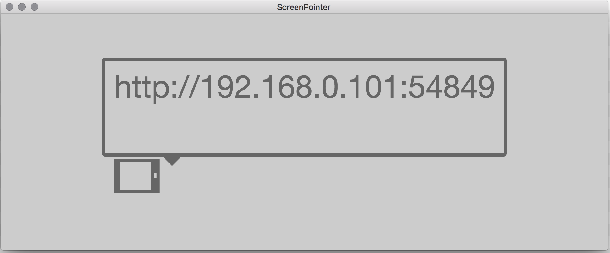
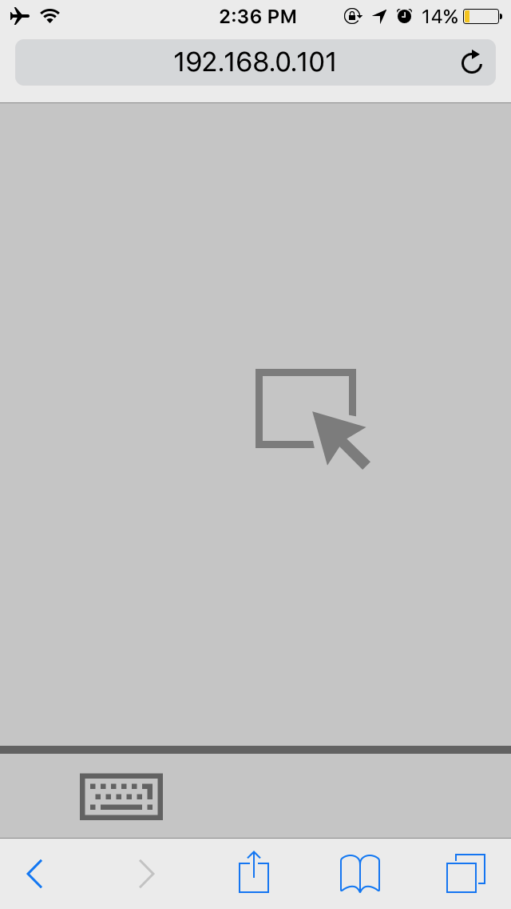

Desktop (ElectronJS) application that creates a light HTTP (ExpressJS) server where other devices in the same network can connect to and control the screen cursor and keyboard.

VueJS was used to compile Jade/CSS and Vaadin-Icons were used.

# Build

+ NodeJS & NPM must be installed
+ clone this repo
+ run `npm run build:all`\* in repo directory

\* If you're on windows, you may need to replace `&&` w single `&` in the `package.json`

## deprecated versions
[v2.0](releases/tag/v2.0) is all about porting it to Spring Boot.

[v1.0](releases/tag/v1.0) is for the 2009 project code from [Google Code Archive](https://code.google.com/archive/p/screenpointer/source/default/commits) which was implemented using sockets & servlets; educational/experimental purpose somehow :D
... now I'm changing the whole thing!
